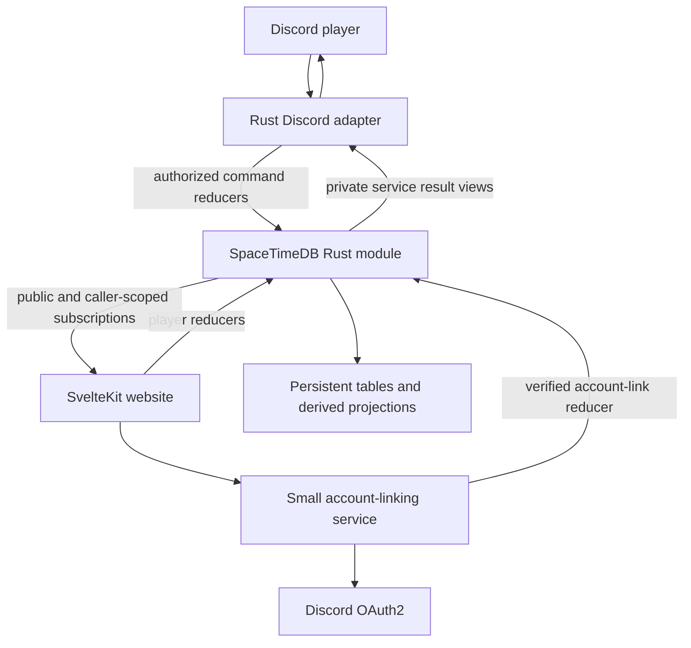

# Fishing Game: SpaceTimeDB + Rust Design Specification

**Status:** Proposed implementation foundation, not an implemented product  
**Date:** October 3, 2026  
**Working title:** Fishbound (placeholder; renaming must not affect domain identifiers)  
**Audience:** Codex, maintainers, game designers, and future contributors

## 1. Product vision

A player types `/fish` in Discord and pulls something out of a persistent shared world: a tiny creek minnow, a record-breaking catfish, a suspicious boot, a sealed treasure chest, or a creature so rare the whole server stops to look.

Every fish has a species, a rarity tier, an individual length and weight, and provenance. Players unlock biomes, improve rods, choose bait, fill a collection book, earn achievements, and compete over records. A companion website makes the long-term game tangible: catches, collection progress, equipment upgrades, player statistics, achievements, and live leaderboards.

Discord supplies the immediate social moment. The website supplies depth and navigation. Rust reducers in SpaceTimeDB own the rules and state for both.

The game should feel approachable in one command and deep after a thousand casts. It is an asynchronous collection RPG with social discovery, not a real-time fishing simulator in V1.

### 1.1 Experience pillars

1. **Every cast tells a small story.** Results have personality, clear measurements, and useful progress.
2. **Common catches still matter.** A large common fish can set a record; ordinary catches finance upgrades and fill milestones.
3. **Choices have understandable effects.** Biome, bait, and rod alter named outcomes without silently making everything better.
4. **Rare discoveries remain memorable.** High tiers are scarce, visibly distinct, and cannot be bought directly.
5. **Progress survives disposal.** Selling or releasing a fish never erases its collection discovery or historical record.
6. **One authoritative game.** Discord and the website cannot disagree about wallet, cooldown, equipment, or rewards.
7. **Respect player attention.** No streak punishment, mandatory daily chores, or pressure to cast continuously.

### 1.2 Core loop

```text
Choose biome → equip rod and bait → /fish → receive result
       ↑                                  ↓
Unlock access ← gain XP ← collect / sell / salvage / release
       ↑                                  ↓
       └──────── improve equipment ← earn resources
```

Secondary loops are collection completion, achievement goals, size records, and biome mastery. The website should show a useful next goal, such as “Discover two more river species” or “Save 180 coins for rod level 3.”

### 1.3 Firm V1 decisions

- Plain slash command `/fish`; the owner clarified that `./` was only a chat workaround and is not an alias.
- One global player account per Discord user, usable across guilds.
- One shared economy and a 60-second cooldown per player, not one per guild or client.
- Immediate server resolution with a brief optional presentation animation.
- Ten catch rarity tiers: **F, D, C, B, A, S, SS, SSS, UR, UUR**.
- Three result categories: fish, junk, treasure.
- Persistent species discoveries and personal records.
- Coins and a small set of upgrade materials; no player trading or premium currency.
- The website may manage equipment and inventory but does not initiate casts in V1.
- No rod durability in V1. Upgrades and consumables provide sufficient sinks.
- No individual timeout job for every cast; eligibility uses server timestamps.

All numbers below are provisional balance defaults. They are concrete enough to implement and test, but must be revised from simulation and playtest evidence.

## 2. Architecture and why SpaceTimeDB fits



### 2.1 Fit

The central workload is small authoritative transactions affecting related state: a cast consumes bait, creates a specimen, grants XP, updates collection progress, and may change a leaderboard. SpaceTimeDB reducers provide the mutation boundary, while subscriptions distribute state changes to connected clients. This removes the need to build a separate polling API and custom WebSocket replication layer for ordinary game state. See the official [reducer overview](https://spacetimedb.com/docs/functions/reducers/) and [views documentation](https://spacetimedb.com/docs/functions/views/).

A cast should succeed as one transaction or leave no partial reward. The website can observe the committed changes and update several panels from the same authoritative result. The bot can reconnect and recover a committed result instead of fishing again.

Rust is useful for strongly typed game rules, checked integer arithmetic, reproducible simulations, and sharing pure rule helpers between tests and the module. Generated Rust and TypeScript bindings keep client contracts aligned with reducers and tables.

### 2.2 Practical limits

SpaceTimeDB does not replace Discord networking, OAuth redirects, image hosting, or every operational task. Those remain outside the module. In-memory state also makes indefinite specimen retention expensive; bounded history and aggregated records are part of the design, not a later cleanup exercise.

Subscriptions are not an excuse to expose every row. Clients subscribe only to relevant public projections and caller-scoped private views. A client-side SQL filter is a bandwidth choice, not an authorization boundary. [Table access permissions](https://spacetimedb.com/docs/tables/access-permissions/) explain the difference.

No scalability claim follows automatically from the technology choice. Before broad rollout, load-test reducer latency, memory growth, subscription fan-out, reconnect behavior, and public feed traffic with realistic active-player counts.

### 2.3 Component responsibilities

| Component | Owns | Must not own |
|---|---|---|
| Rust game module | Authorization, RNG, cooldown, catch resolution, inventory, XP, wallet, records, rewards | Discord HTTP calls, OAuth secrets, presentation formatting |
| Rust Discord adapter | Interaction validation/dispatch, deferral, reducer calls, response formatting, reconnects | Catch probabilities, rewards, cooldown enforcement, balance |
| SvelteKit website | Rendering, navigation, account-link UX, subscriptions, invoking player actions | Trusted balances, inventory ownership decisions, independent RNG |
| Account-linking service | Discord OAuth flow, session security, verified identity binding | Fishing outcomes or direct wallet changes |
| Content tooling | Validate/version species, biome, item, and reward definitions | Unreviewed live economy mutations |

### 2.4 Suggested repository

```text
fishing-game/
  crates/game-rules/          # pure formulas, weighted sampling, unit tests
  crates/discord-bot/         # Rust Discord adapter; Twilight or Serenity
  crates/account-link/        # optional Rust HTTP service, or SvelteKit server routes
  spacetimedb/                # Rust module: tables, views, reducers, schedules
  apps/web/                  # SvelteKit + TypeScript
  packages/generated/        # generated TypeScript bindings
  crates/discord-bot/src/module_bindings/  # generated Rust bindings
  content/                   # versioned input definitions and validation tooling
  simulations/               # distribution and economy tools
  docs/                      # architecture decisions and operational runbooks
```

Pin compatible CLI, module crate, and client SDK versions during the first technical milestone. Do not assume documentation's displayed major-version label is the installed patch version. Regenerate bindings after schema changes; never hand-edit generated files. Native tests target pure rule code and adapters; validate host-dependent module code with a WASM build and integration tests against a running database.

## 3. Identity, account linking, and authority

### 3.1 Three identifiers with distinct roles

- `PlayerId`: internal stable numeric game account ID.
- `DiscordUserId`: external Discord snowflake, stored as `u64` in Rust and transported as a decimal string where JavaScript precision would be unsafe.
- `Identity`: SpaceTimeDB authenticated client identity, linked to a player only after proof.

A browser cannot claim a player simply by submitting a Discord ID. The Discord bot is a trusted adapter, but its service identity is not itself the player. Reducers receiving a Discord user ID must first authenticate the calling service and check its narrowly granted role.

### 3.2 Proposed V1 website login

Use Discord OAuth2 through server-side SvelteKit routes or a small Rust service. The service exchanges the authorization code, calls Discord's authenticated identity endpoint, and obtains the verified Discord user ID. It then binds an independently authenticated SpaceTimeDB browser identity to that player using a one-time challenge.

Recommended sequence:

1. Browser connects to SpaceTimeDB and calls `begin_link_challenge()` as its own identity.
2. The module creates a short-lived, single-use challenge bound to that sender.
3. Browser starts Discord OAuth; server stores the challenge reference and OAuth state in a protected server session.
4. Callback validates state, exchanges the code server-side, and fetches the authenticated Discord user.
5. Authorized linker service calls `complete_account_link(challenge_id, verified_discord_user_id)`.
6. Reducer checks service role, challenge expiry, unused status, and identity/account conflicts; binds and consumes atomically.
7. Browser refreshes its caller-scoped subscriptions and receives the linked profile.

Use cryptographically strong OAuth state generated outside the module by the authentication service. A challenge ID is only a reference; knowledge of it must never grant linking authority. Never place access tokens or bot credentials in public tables. Protect server sessions with secure cookies and CSRF checks for cookie-authenticated actions. Initially allow one active website identity per player; a later verified login can replace it and revoke the old mapping. Account merges are not automatic.

SpaceTimeDB authentication supports OIDC tokens, but a Discord OAuth access token must not be treated as an interchangeable SpaceTimeDB identity token. The exact browser credential persistence and revocation behavior must be verified in the auth proof milestone. See [SpaceTimeDB authentication](https://spacetimedb.com/docs/core-concepts/authentication/).

### 3.3 Authorization rules

- Player website reducers resolve `ctx.sender()` through `PlayerIdentity`.
- Bot reducers require `ServiceRole::DiscordAdapter`, then resolve the verified Discord ID.
- Account-link reducers require `ServiceRole::AccountLinker`.
- Content/admin reducers require an explicit admin role; guild administrator status is insufficient.
- Role bootstrap is controlled by deployment owner configuration; there is no public “make me admin” reducer.
- All ownership checks happen inside reducers and scoped views.
- Inventory, wallet, identity mappings, raw receipts, and service roles are private.
- Public profiles are explicit projections with no external identity or sensitive account fields.

Trust boundary: a compromised bot can impersonate Discord actions for users it names. Minimize that service's capabilities, rotate credentials, audit its actions, and keep economy grants outside its role. SpaceTimeDB authority prevents malicious ordinary clients from choosing results; it cannot make a compromised trusted adapter honest.

## 4. Game vocabulary and numeric conventions

| Concept | Definition |
|---|---|
| Species | Catalog definition, such as Moonfin Carp |
| Specimen | One individual caught fish, with measurements and provenance |
| Catch rarity | F through UUR; derived from species-relative length and weight and saved per specimen. Every ordinary species supports all ten ranks. Fihs is UUR-only and the Sock F-only. |
| Size grade | Tiny, Small, Typical, Large, Trophy, Colossal; relative to that species |
| Variant | Optional visual/lore trait; future expansion, separate from rarity |
| Catch category | Fish, junk, treasure |
| Discovery | Lifetime proof the player has caught a species |
| Kept catch | Inventory specimen available to sell, release, favorite, or display |
| Historical record | Preserved measurement/provenance, independent of inventory |

Store money, XP, quantities, weight, and length as integers. Use grams and millimeters internally; presentation can convert to kilograms and centimeters. Use basis points for bounded percentages and larger integer weights for very rare rolls. All arithmetic uses checked operations and documented rounding. Numeric IDs crossing JavaScript boundaries use generated bigint types or decimal strings consistently.

Tier ordering is explicit. Do not sort rarity strings alphabetically. Keep the requested tier sequence exactly; do not insert E or rename UUR into a different system.

## 5. Rarity and species model

### 5.1 Starter reference weights

These are **conditional fish-tier weights** when every tier is eligible. They sum to 1,000,000. They are not the probability of every cast, and individual species within a tier are rarer still.

| Tier | Weight | Conditional chance | Approx. fish catches per tier result |
|---|---:|---:|---:|
| F | 450,000 | 45% | 2.22 |
| D | 270,000 | 27% | 3.70 |
| C | 150,000 | 15% | 6.67 |
| B | 75,000 | 7.5% | 13.33 |
| A | 35,000 | 3.5% | 28.57 |
| S | 14,000 | 1.4% | 71.43 |
| SS | 4,500 | 0.45% | 222.22 |
| SSS | 1,200 | 0.12% | 833.33 |
| UR | 270 | 0.027% | 3,703.70 |
| UUR | 30 | 0.003% | 33,333.33 |

With an 82% fish category probability, baseline UUR chance is `0.82 × 30 / 1,000,000`, approximately one per 40,650 casts in an all-tier eligible pool. At a 60-second cooldown that is roughly 678 hours of continuous eligible casting in expectation. This is deliberately a warning about tuning: UUR should be a long-term surprise, not a required V1 completion gate. Expected wait is not a promise; the probability of at least one success after `n` casts is `1 - (1 - p)^n`.

The current version-4 implementation samples a species and weighted physical size band after the biome category roll, generates length and weight, and classifies the highest rank whose species-relative minimums both hold. Each biome has exactly 1,000,000 conditional fish tickets. This allows the F-rank Sock to remain exceptionally rare without a second catch path. Each species currently has one home biome. Each ordinary species can earn all ten ranks through physical size; rarity is a saved catch property. Fihs and the Sock have their specified single-rank restrictions; the reference tier weights are not applied a second time.

Publish baseline conditional chances and describe contextual changes accurately. Do not claim the same odds apply to every biome or equipment setup.

**Owner-approved balancing direction:** soften the upper rarity curve toward months of active play for an average exceptional catch, while retaining much longer unlucky waits. Fihs is UUR and second-rarest overall; Nidalees Lost Sock is F rank and the rarest overall, with half Fihs's encounter probability. Neither is required for progression or ordinary collection completion. The active version-4 encounter weights describe species/physical-size-band tickets after the category roll. world-balance.md records exact odds and realistic daily-cast wait quantiles, preserving this ordering and ratio; the table above remains a historical tier reference.

### 5.2 Tier identity

F and D are everyday ecosystems. C and B represent less frequent or more distinctive species. A and S introduce strong biome identity and valuable discoveries. SS and SSS are headline catches. UR and UUR represent legendary discoveries with individual lore and conservative eligibility rules.

Rank measures size relative to the species, rather than absolute kilograms. A UUR minnow can outrank a B shark. Both length and weight must meet the tier minimum; UUR requires at least 1.85 times typical length and 6.331625 times typical weight. Fihs remains UUR-only and the Sock F-only. Rarity does not automatically guarantee the highest sale value either, though it usually raises the base value.

### 5.3 Example species

| Species | Tier | Biome | Typical length | Typical weight | Role |
|---|---|---|---:|---:|---|
| Pebble Minnow | F | Meadow Pond | 90 mm | 14 g | Starter discovery and cheap bait target |
| Copper Gill | D | Meadow Pond | 180 mm | 140 g | Reliable early income |
| Reed Pike | C | Whispering River | 520 mm | 1,200 g | Predator bait incentive |
| Marsh Titan Catfish | B | Hollow Marsh | 950 mm | 11,000 g | Weight record chase |
| Moonfin Carp | A | Moonlit Lake | 430 mm | 1,700 g | Lake signature species |
| Frostveil Trout | S | Glacial Reach | 610 mm | 2,800 g | Cold-water milestone |
| Lanternjaw | SS | Sunken Coast | 740 mm | 6,200 g | Coastal signature rarity |
| Crowned Abyss Ray | SSS | Abyssal Shelf | 1,850 mm | 44,000 g | Late-game trophy |
| Glass Oracle | UR | Moonlit Lake | 160 mm | 38 g | Tiny legendary counterexample |
| Last Tide Leviathan | UUR | Abyssal Shelf | 5,800 mm | 320,000 g | Long-term legendary discovery |

Values are fictional game definitions, not biological claims. Stable catalog keys such as `moonfin_carp` survive display-name changes.

## 6. Length, weight, and specimen quality

### 6.1 Distribution

Length and weight should correlate without being identical leaderboards. V1 uses bounded integer distributions rather than unbounded normal draws.

The active version-4 path samples weighted physical bands calibrated to preserve the approved encounter odds. It draws integer length within the band and correlated weight within the band's minimum and species bounds, then derives the highest qualifying rank from both measurements. Published cutoffs are in `content/size-rules.json` and the companion catalog. Every allowed species/band is validated as reachable. Rewards and records use the final saved measurements and rank.

The following six-band distribution is the original design reference, superseded for active cast generation by the ten physical rank bands above:

1. Roll a size band.
2. Draw a relative length factor within the band's range.
3. Apply a bounded equipment shift inside the species' absolute limits.
4. Calculate weight from relative length cubed and an independently rolled condition factor.
5. Clamp to species minima/maxima and classify the final size grade from final relative length.

Suggested unmodified bands:

| Band | Probability | Relative length range |
|---|---:|---:|
| Tiny | 8% | 0.55–0.74 |
| Small | 22% | 0.75–0.89 |
| Typical | 50% | 0.90–1.14 |
| Large | 16% | 1.15–1.34 |
| Trophy | 3.8% | 1.35–1.59 |
| Colossal | 0.2% | 1.60–1.85 |

Represent factors in millionths; choose explicit boundaries without overlaps. Species may override limits and bands where appropriate. A deterministic fixed-point implementation avoids cross-platform floating-point differences in persisted values.

```text
length_mm = clamp(round(typical_length_mm × length_factor), min_mm, max_mm)
actual_ratio = length_mm / typical_length_mm
weight_g = clamp(
    round(typical_weight_g × actual_ratio³ × condition_factor),
    min_weight_g,
    max_weight_g
)
condition_factor ∈ [0.88, 1.12]
```

Use checked wide intermediate arithmetic, preferably `u128`, and divide in a documented order. Clamping creates accumulation at hard caps; simulations must verify that equipment does not drive too many specimens to identical maxima.

### 6.2 Example

A Moonfin Carp has typical length 430 mm and weight 1,700 g. A relative length draw of 1.40 gives 602 mm. At condition 1.06, weight is approximately `1,700 × 1.40³ × 1.06 = 4,945 g`. It is Trophy-sized; under the active two-measurement thresholds its rank is S. Another carp of the same length could weigh less because condition differs.

### 6.3 Stored evidence

Store species ID, catalog version, rule version, final length/weight, size grade, caught time, biome, player ID, and source guild if present. Public record projections omit the raw guild/user identifiers. Store selected configuration IDs in a private cast audit for debugging; do not expose RNG internals.

Changes to future generation never recalculate old specimen measurements. Records compare final stored integers. If a balance update changes species limits substantially, retain all-time records but introduce a new competitive season rather than silently rewriting history.

## 7. Biomes and access progression

Biomes define encounter pools, category weights, unlock gates, gear requirements, descriptions, and later environmental schedules. They should change the collection chase and strategy, not merely multiply rewards.

| Biome | Level | Rod power | Identity | Starting category split fish/junk/treasure |
|---|---:|---:|---|---|
| Meadow Pond | 1 | 0 | Friendly start, small freshwater fish | 86 / 12 / 2 |
| Whispering River | 5 | 10 | Predators, current, varied sizes | 83 / 13 / 4 |
| Hollow Marsh | 10 | 20 | Heavy fish, salvage, strange finds | 77 / 18 / 5 |
| Moonlit Lake | 18 | 35 | Elegant rare species and collection goals | 84 / 11 / 5 |
| Sunken Coast | 28 | 50 | Saltwater species and better treasure | 80 / 13 / 7 |
| Glacial Reach | 40 | 65 | Cold-water specialization | 83 / 12 / 5 |
| Abyssal Shelf | 55 | 85 | Late-game legends and abyssal materials | 78 / 14 / 8 |

Owner scope update (October 4, 2026): implement all seven biomes and all 251 supplied species now. Every biome has a nonempty active encounter pool. Raise the cap to 60 and provide free level-earned access rods so all original level/power gates are reachable. Prototype stats and exact odds are recorded in world-balance.md.

Access is checked both when changing biome and when casting. A player can become ineligible after unequipping a rod. Reject that cast with a useful message or require an explicit return to an eligible biome; do not secretly fish somewhere else.

### 7.1 XP and levels

Prototype cost to advance from level `L` to `L+1`:

```text
xp_to_next(L) = 80 + 25L + 5L²
```

Level 1 needs 110 XP; level 10 needs 830 XP; level 25 needs 3,830 XP. Store total lifetime XP as the source of truth and compute level through a versioned threshold catalog. Current level cap: 120, expanded for the owner-requested seven-biome implementation.

Fish XP starts from tier values `[8, 12, 18, 28, 44, 70, 110, 180, 300, 500]`. Size bonus ranges from 0% to 25%. First discovery adds a one-time fixed species reward. Junk grants 2 XP and treasure 8 XP initially. Avoid sale-value-based XP so economy adjustments do not accidentally alter progression.

Grant XP once on catch resolution, never again on sale. Loop across multiple threshold crossings when a reward unlocks several levels. Level-up grants unlock access and modest fixed rewards, with ledger entries, but should not refund unlimited casting resources.

The curve must be evaluated against expected XP/cast by biome and realistic session lengths. Target first biome unlock in approximately 15–30 minutes of casual play and second unlock over several sessions; adjust the formula to reach the target, not the target to justify the formula.

### 7.2 Biome mastery

V1 collection pages show biome discoveries and catches. Later mastery can grant cosmetics, titles, and narrow bait unlocks. Do not require UUR discovery to complete the main biome progression track.

## 8. Rods, equipment, and bait

### 8.1 Rod design

A rod template plus upgrade level defines effective stats. Keep formula derivation in the module so clients cannot invent effective stats.

| Stat | Effect | Guardrail |
|---|---|---|
| Power | Unlocks biomes/gear-gated species | Explicit threshold, not hidden catch failure |
| Luck | Changes eligible tier weights | Bounded integer adjustment |
| Size | Slightly shifts relative length | Species caps and a conservative maximum |
| Clean cast | Reduces junk weight | Category probabilities normalized after adjustment |
| Treasure affinity | Increases treasure weight | Independent from fish-tier luck |

Current access rod templates: Twig, River, Marsh, Moonwood, Tide, Glacial, and Abyssal Rod. Twig is free; later rods are purchased at the camp trader at levels 5, 10, 18, 28, 40, and 55. A permanent biome licence is also required, bought in biome order. Upgrade recipes remain a later economy feature; suggested upgrade levels 0–5. Twig remains a low-cost stepping stone; specialization begins when River and Marsh are both viable choices.

For each eligible tier, apply a named multiplier in basis points. Example: luck strength boosts A and above by at most 25%, leaves C/B unchanged, and slightly reduces F/D. Normalize after all adjustments. This means “25% more relative high-tier weight,” not “25 percentage points more high-tier probability.” UI wording must reflect this distinction.

Recommended modifier order: eligibility → biome base weights → rod multipliers → bait multipliers → caps → normalization → sampling. Version this order as part of the rules.

### 8.2 Upgrades

Example River Rod upgrade:

```text
Level 2 → 3
Cost: 450 coins + 8 scrap + 2 river pearls
Benefit: power +5; high-tier weight multiplier +2 percentage points
```

`upgrade_rod` receives rod ID, expected current level, request ID, and optionally the displayed recipe version. It validates ownership and current level, recalculates costs server-side, checks balances, deducts inputs, increases the level, and appends audit entries atomically. A stale expected level or recipe fails before spending. No chance-based upgrade destruction in V1.

### 8.3 Bait

| Bait | Consumption | Effect | Intended use |
|---|---|---|---|
| No bait | None | Baseline catch pool | Player can always continue |
| Worm | One per successful cast | Freshwater species weights +20% | Early specialization |
| Minnow lure | One per successful cast | Predator species weights +35% | River collection hunting |
| Marsh grub | One per successful cast | Marsh signature species weights +25% | Marsh completion |
| Shimmer bait | One per successful cast | A+ eligible tier weights +15% | Later rare hunting |
| Magnet bait | One per successful cast | Junk salvage quality; treasure weight +20% | Resource hunt |

Bait changes weights, not guaranteed outcomes. It cannot introduce species from another biome. Only one bait is active in V1; multiplicative stacking is excluded. Consume bait for fish, junk, or treasure after the request is accepted. A rejected cast consumes nothing. If selected bait has run out, return `BAIT_EMPTY` and let the player explicitly choose no bait; do not silently substitute during a cast.

Bait catalog definitions carry compatible biome/tags, price, modifiers, and maximum quantity per purchase. No bait changes the cooldown in V1, preserving a simpler abuse model and economy.

## 9. Junk and treasure

### 9.1 Junk

Junk is a minor disappointment with useful conversion, not a completely wasted action. Examples: soggy boot, tangled line, broken lure, driftwood, rusted tin, strange old key. Junk inventory is stack-based by item definition.

- Sell cheap items for modest coins.
- Salvage designated items for deterministic materials.
- Keep special curios for achievements or collection milestones.
- Never let salvage output sell for more than the cheapest repeatable input purchase cost.

Example: one rusted tin salvages into one scrap; one driftwood into one timber. A collectible boot may be useful only for “Footwear Fisher: catch ten boots.” This gives silly results a memory without making junk the optimal income source.

### 9.2 Treasure

V1 treasure resolves its reward bundle during the catch transaction and presents the discovery immediately. A chest is a result theme, not an inventory object requiring another random roll. This avoids extra receipt and storage complexity.

Example River Cache: 25–60 coins plus 1–3 scrap, with a small chance of one river pearl. Persist the exact reward bundle in the receipt. Add materials and currency through the same authoritative economy helpers as other rewards.

Future unopened chests require their own inventory identity, single-use open receipt, loot-table version, and atomic consume/grant operation. Do not add them casually by putting random rewards in website code.

### 9.3 Category modifier safety

Base category weights might be `[8200, 1400, 400]`. Apply clean-cast and treasure modifiers as bounded transformations, then normalize. Never separately roll fish, junk, and treasure; that can yield multiple outcomes or none.

Any modifier combination must leave at least one positive category weight. Content validation rejects zero-sum pools and unsupported outputs. Missing live content causes a failed transaction with no bait/cooldown charge, plus an operational alert.

## 10. Economy, inventory, and disposition

### 10.1 Currency sources and sinks

Sources: fish sales, junk sales, treasure, one-time achievements, and limited milestone rewards. Sinks: rod purchases/upgrades, bait purchases, crafting materials, later cosmetics and display capacity.

Avoid currencies without a clear use. V1 uses coins, scrap, timber, and river pearls. Material definitions can grow with new biomes. There is no real-money purchase or player transfer in the foundation.

Prototype sale formula:

```text
fish_value = floor(base_species_value × bounded_size_value_factor)
bounded_size_value_factor ∈ [0.60, 2.00]
```

Use relative size, not absolute kilograms, so small species remain relevant. Store a sale-value snapshot at catch time and honor it for that specimen. This prevents balance updates from retroactively destroying kept-catch value. Catalog migrations may explicitly replace this policy only with a documented player-facing decision.

### 10.2 Inventory rules

- Every kept fish is an individually identified specimen.
- Junk, bait, and materials are quantity stacks with unique logical `(player, item)` keys.
- Rods are individually owned instances so future specialization remains possible.
- Kept-specimen storage is unlimited. Players may keep every catch, including favorites.
- Inventory size does not block a cast. Cooldown, identity, equipment, and biome requirements still apply.
- Inventory displays show the number of fish kept, with pagination for browsing and explicit sell/release actions.
- No automatic sale in V1. Later autosell must be an explicit per-player rule with protected favorites.

Future display slots are separate from unlimited fish storage. Monitor retained specimens and subscription costs as collections grow; storage is not a paid upgrade.

### 10.3 Selling, releasing, and salvaging

`sell_catches(ids)` uses a bounded batch, e.g. at most 50 IDs; rejects duplicate IDs; verifies ownership, unsold state, and no favorites. The whole batch succeeds or fails. Request receipts prevent retries from double-crediting. A release removes the owned specimen with no coin reward in V1. A salvage consumes stack quantity and grants the defined materials atomically.

Disposition removes active inventory rows, but collection summaries and records retain their evidence. Recent history retains a limited display summary. Do not create an immortal full specimen row for every catch solely to support a counter.

### 10.4 Economy monitoring

Track coins minted/burned by reason, material generation/consumption, average sale value, upgrade time, bait spend, and coin distribution. Simulate no-bait play, common bait, specialist bait, and high upgrades separately. If a bait purchase yields substantially more incremental coin return than its cost, decide whether it is an intended progression tool or an infinite profit amplifier.

Upgrades must improve enjoyment without compounding income so fast that each upgrade finances the next in minutes. Do not solve inflation by quietly worsening live odds.

## 11. Collection book, records, and achievements

### 11.1 Collection book

Each species has unknown, discovered, and optional mastery states. Unknown entries show a silhouette and broad biome hints. Discovered entries show name, allowed rarities, caught-rank progress, lore, encounter locations, lifetime catch count, first caught time, best length, best weight, and best size grade.

The book summarizes species discoveries per biome and tier. Selling all inventory fish leaves discovery intact. V1 catalogs can be public; silhouettes are a presentation choice, not a secrecy claim. If hidden-species secrecy becomes important, move spoiler definitions behind scoped unlock views rather than shipping them to every browser.

### 11.2 Records

Keep separate largest-length and heaviest-weight records per species, both personally and globally. Avoid “largest fish” combining tiny and giant species into one misleading score.

Tie policy: larger measurement wins; ties go to the earlier authoritative catch timestamp, then smaller catch ID. Both dimensions use the same policy. Public records include player public ID/name, measurement, species, caught time, and rule/catalog versions.

A record projection stores its own provenance snapshot, so selling the winning specimen does not invalidate the leaderboard. Bugged/admin-created catches are excluded from ranked updates. Corrections use admin-reviewed ledgered operations and record rebuild tooling.

### 11.3 Leaderboards

V1 boards:

- Species discoveries, with explicit tie ordering.
- Lifetime fish count.
- Per-species heaviest catch.
- Per-species longest catch.

Defer wallet leaderboards, which incentivize hoarding and make balance changes unusually contentious. Later seasons can use new species discoveries, qualifying catches, or normalized trophy points. If normalized records are added, publish the scoring formula and version it.

Maintain per-player score rows and per-species best records incrementally. Materialize bounded top-100 pages on a scheduled cadence where needed. Do not subscribe browsers to every player's catch history to compute rankings. Show the leaderboard refresh time if it is not updated immediately.

Guild boards include only opted-in membership projections. Casting in a guild is insufficient proof of enduring membership. V1 can expose global boards and records without maintaining cross-guild membership tracking; guild-specific competitions are a later feature.

### 11.4 Achievements

| Achievement | Condition | Example reward |
|---|---|---|
| First Cast | Complete one cast | Title: Novice Angler |
| Fish, Finally | Catch first fish | 20 coins |
| Pond Naturalist | Discover all ordinary pond species | 80 coins and a cosmetic |
| Big Mood | Catch first Trophy specimen | Title: Trophy Hunter |
| Boot Collector | Catch ten boots | Cosmetic badge |
| Into the Reeds | Unlock Hollow Marsh | 10 marsh grubs |
| Rare Company | Catch first A+ fish | Profile badge |
| One Thousand Ripples | Complete 1,000 casts | Cosmetic frame |

Conditions are typed and bounded: cumulative count, discovery set, qualifying size, level threshold, biome unlock. Avoid arbitrary scripts or scanning the whole history after each cast. Increment relevant counters and evaluate only affected achievement groups.

V1 rewards are granted automatically in the same transaction that completes the achievement. Store `completed_at` and `reward_granted_at`; one player/achievement logical key prevents duplicate grants. A future manual `claim_achievement` must use that same state and atomic grant helper. UI may show a celebratory “claim” animation but must not accidentally duplicate an already issued reward.

## 12. Data model

These are conceptual schemas; exact macros, indexes, and view return types must be compiled against the selected SDK. Fields are suggested minima, not a requirement to implement every future table in V1.

### 12.1 Catalog tables

| Table | Key | Important fields | Exposure |
|---|---|---|---|
| `GameRules` | `version` | cooldown, modifier caps, level cap, activation time | Selected public rules |
| `RarityDefinition` | `tier` | ordinal, label, color token, reference weight, minimum relative length/weight in millionths | Public |
| `SpeciesDefinition` | `species_id` | stable key, name, tier, tags, typical/min/max measurements, base XP/value, version | Public V1 |
| `BiomeDefinition` | `biome_id` | stable key, min level/power, category weights, live flag | Public |
| `BiomeEncounter` | `encounter_id` | biome, species, encounter weight, optional eligibility flags | Public or curated odds view |
| `RodDefinition` | `rod_def_id` | template stats, max level, purchase cost | Public |
| `RodUpgradeRecipe` | `recipe_id` | rod template, source level, stat deltas, version | Public |
| `RecipeCost` | `cost_id` | recipe, item/currency, amount | Public |
| `ItemDefinition` | `item_id` | kind, stack limit, tags, sell/salvage rules | Public |
| `BaitModifier` | `modifier_id` | bait item, target kind/tag/tier, multiplier | Public |
| `LootEntry` | `loot_entry_id` | pool, result, weight, quantity bounds | Private; public summaries |
| `AchievementDefinition` | `achievement_id` | typed condition, target, threshold, reward version | Public |
| `LevelThreshold` | `level` | cumulative XP required, rule version | Public |

Structured cost/reward rows are preferable to unvalidated JSON blobs for authoritative operations. Content validation checks references, positive weights, contiguous rarity order, recipe costs, measurement bounds, and level thresholds before activation.

### 12.2 Player and account tables

| Table | Key | Important fields |
|---|---|---|
| `Player` | `player_id` | Discord ID unique, created time, status, active biome, active rod, active bait |
| `PlayerIdentity` | `identity` | player ID, linked time, revoked flag |
| `ServicePrincipal` | `identity` | role, active flag |
| `LinkChallenge` | `challenge_id` | browser identity, expiry, consumed time |
| `PlayerProgress` | `player_id` | total XP, level cache, completed casts, fish/junk/treasure counts |
| `Wallet` | `player_id` | coins |
| `CastState` | `player_id` | next eligible timestamp, accepted cast sequence |
| `PublicProfile` | `player_id` | sanitized display name, level, title, discoveries, visibility |

All account and gameplay state above is private except `PublicProfile`. Private caller-scoped views return only rows belonging to the linked player. Bot service views resolve the adapter's role and expose only the fields required for responding; inventories and OAuth data do not need a global bot subscription.

### 12.3 Inventory, history, and projections

| Table | Key | Important fields |
|---|---|---|
| `OwnedRod` | `rod_id` | player, template, upgrade level, created time |
| `InventoryStack` | `stack_id` | player, item, quantity; enforce unique logical pair |
| `OwnedSpecimen` | `catch_id` | player, species, biome, measurements, grade, versions, sell snapshot, favorite |
| `RecentCatch` | `recent_id` | player, catch/result ID, compact result snapshot, time |
| `PlayerSpeciesProgress` | `progress_id` | player/species unique pair, count, first discovery, best measurement snapshots |
| `PlayerBiomeProgress` | `progress_id` | player/biome unique pair, counters, discovery count |
| `PlayerAchievement` | `grant_id` | player/achievement unique pair, counters, completed/reward timestamps |
| `SpeciesRecord` | `record_id` | species, metric, holder, winning measurement, catch snapshot |
| `LeaderboardEntry` | `entry_id` | board/season/player, score, tie fields |
| `PublicCatchFeed` | `feed_id` | opt-in notable result projection, public profile ID, expiration |

### 12.4 Reliability and audit

| Table | Key | Important fields |
|---|---|---|
| `CommandReceipt` | `receipt_key` | caller namespace, request ID, player, command, canonical arguments, status, result snapshot, time |
| `EconomyLedger` | `ledger_id` | player, currency/item, signed delta, reason, operation ID, time |
| `CastAudit` | `cast_id` | player, request ID, rules/content version, rod/bait/biome IDs, outcome, time |
| `MaintenanceSchedule` | `schedule_id` | schedule timestamp/interval, task kind |
| `AdminAudit` | `audit_id` | actor, operation, reason, affected account/content, time |

Do not implement uniqueness with ambiguous concatenation. Use a supported unique composite index if available in the pinned version, or a canonical collision-free tuple key plus indexed lookups and transactional checks. Never assume a secondary index alone enforces uniqueness.

Indexes prioritize player-owned lookups, `(player, species)`, biome encounter lookup, request receipt lookup, and expiry scans. Avoid full-table scans inside cast reducers. Validate query plans and actual module behavior rather than importing relational SQL assumptions.

### 12.5 Illustrative Rust shapes

```rust
use spacetimedb::{Identity, SpacetimeType, Timestamp};

#[derive(SpacetimeType, Clone, Copy, Debug, PartialEq, Eq)]
pub enum Rarity { F, D, C, B, A, S, SS, SSS, UR, UUR }

#[derive(SpacetimeType, Clone, Debug)]
pub enum CatchOutcome {
    Fish { catch_id: u64, species_id: u32, length_mm: u32,
           weight_g: u64, size_grade: u8 },
    Junk { item_id: u32, quantity: u32 },
    Treasure { reward_bundle_id: u64 },
}

// Conceptual fields; apply verified table/index macros during implementation.
pub struct PlayerIdentityRow {
    pub identity: Identity,
    pub player_id: u64,
    pub linked_at: Timestamp,
}

pub struct SpecimenRow {
    pub catch_id: u64,
    pub player_id: u64,
    pub species_id: u32,
    pub biome_id: u32,
    pub length_mm: u32,
    pub weight_g: u64,
    pub caught_at: Timestamp,
    pub sale_value_coins: u64,
    pub rules_version: u32,
    pub content_version: u32,
    pub favorite: bool,
}
```

Reducers typically return success/failure rather than an arbitrary response payload. Rich results belong in durable receipt rows read through an authorized result view. Current 2.x clients must not depend on obsolete globally broadcast reducer callbacks; see the [2.0 migration guide](https://spacetimedb.com/docs/upgrade/?client-language=rust&server-language=rust).

## 13. Reducer API

Every mutating player operation uses server-derived identity, bounded arguments, and an operation request ID where retry could duplicate spending or rewards.

| Reducer | Caller | Input | Behavior |
|---|---|---|---|
| `ensure_discord_player` | Bot | Discord ID, sanitized name | Idempotent starter account, rod, biome; no repeat welcome rewards |
| `fish_from_discord` | Bot | Discord ID, interaction ID, guild/channel context | Resolve authorized player and execute cast |
| `change_biome` | Player | biome ID | Check access and save selection |
| `equip_rod` | Player | owned rod ID | Check ownership and equip |
| `equip_bait` | Player | optional bait item ID | Check definition, compatibility, stock |
| `buy_rod` | Player | template, request ID | Charge catalog cost, grant owned instance |
| `buy_bait` | Player | item, quantity, request ID | Bounded quantity, authoritative price, checked spend |
| `upgrade_rod` | Player | rod, expected level, recipe version, request ID | Atomic costs and upgrade |
| `set_favorite` | Player | catch ID, desired flag | Ownership check; explicit state avoids toggle retry issues |
| `sell_catches` | Player | bounded IDs, request ID | Atomic batch disposition and credit |
| `release_catches` | Player | bounded IDs, request ID | Atomic removal without reward |
| `salvage_junk` | Player | item, quantity, request ID | Consume inputs, grant outputs |
| `set_public_profile` | Player | allowed name/title/visibility fields | Sanitize; title must be earned |
| `begin_link_challenge` | Browser identity | none | Create bounded expiring challenge |
| `complete_account_link` | Linker | challenge ID, verified Discord ID | Single-use identity binding |
| `activate_content_version` | Admin | validated version, reason | Apply reviewed configuration |
| `maintenance_tick` | Schedule | schedule row | Bounded cleanup and projection refresh |

Discord can add thin adapter variants for biome/equipment actions later; both variants invoke the same private domain functions. Do not call one exported reducer from another as a substitute for a shared helper.

Error codes are stable prefixes such as `COOLDOWN_ACTIVE`, `BAIT_EMPTY`, `BIOME_LOCKED`, `INSUFFICIENT_COINS`, `STALE_UPGRADE`, `ACCOUNT_NOT_LINKED`, `REQUEST_CONFLICT`, and `SERVICE_UNAUTHORIZED`. Adapters map these into friendly messages. Cooldown displays should derive remaining time from authoritative state; local countdowns are estimates only.

## 14. Catch-resolution pipeline

### 14.1 Atomic sequence

1. Authenticate bot service and validate interaction/context identifiers.
2. Resolve or idempotently create the player and starter state.
3. Look up the interaction receipt. If completed and identical, return without changing anything. If its arguments differ, reject a conflict.
4. Reject interactions older than the allowed acceptance window. Derive creation time from the authenticated Discord interaction snowflake; do not trust an arbitrary caller timestamp.
5. Check player status and global cooldown using `ctx.timestamp`.
6. Snapshot active rules, biome, owned rod, and selected bait; verify access and quantities.
7. Keep inventory storage unlimited; no free-slot check is needed.
8. Build eligible category and species pools, with modifiers and checked totals.
9. Roll exactly one category using the module context RNG.
10. For fish: sample species and an eligible weighted physical size band; generate length and weight, derive rank from both species-relative measurements, then produce a specimen.
11. For junk: select weighted item and bounded quantity. For treasure: resolve bounded reward bundle.
12. Consume one bait if equipped; set next eligible time.
13. Grant XP, update level, wallet/material rewards, statistics, and collection progress.
14. Update relevant achievements and records; create an opted-in notable public projection if appropriate.
15. Persist exact receipt and compact recent history; prune bounded overflow.
16. Commit. Bot reads the authoritative result and formats the Discord response.

If any step fails, no new catch, cooldown, bait consumption, or economic changes remain. Validate before RNG where possible, but transaction rollback—not careful ordering alone—provides atomicity.

### 14.2 Pseudocode

```rust
#[spacetimedb::reducer]
pub fn fish_from_discord(
    ctx: &spacetimedb::ReducerContext,
    discord_user_id: u64,
    interaction_id: u64,
    guild_id: Option<u64>,
) -> Result<(), String> {
    require_service_role(ctx, ServiceRole::DiscordAdapter)?;
    let player = resolve_discord_player(ctx, discord_user_id)?;
    let key = discord_receipt_key(interaction_id);

    if let Some(receipt) = lookup_receipt(ctx, &key) {
        verify_same_command(&receipt, player.id, guild_id)?;
        return Ok(()); // Existing durable result; never roll again.
    }

    require_fresh_discord_interaction(ctx, interaction_id)?;
    let loadout = validate_cast_and_snapshot(ctx, &player)?;
    let outcome = resolve_catch(ctx, &loadout)?; // ctx RNG only
    apply_catch_transaction(ctx, &player, &loadout, &outcome)?;
    store_receipt(ctx, key, &player, &loadout, &outcome)?;
    Ok(())
}
```

Helpers above are design pseudocode, not generated SDK methods. Reducer RNG must use the context-provided source; external random generators are inappropriate for module execution. See [reducer context and RNG](https://spacetimedb.com/docs/functions/reducers/reducer-context/).

### 14.3 Weighted sampling

Sum positive `u64` weights with checked arithmetic, draw an unbiased integer in `[0, total)`, and walk cumulative weights until the interval containing the draw is found. Do not use naive `% total` mapping where it creates modulo bias. Weighted sampling must have explicit tests for zero weights, one entry, boundary values, and maximum totals.

### 14.4 Idempotency and retention

Discord receipts are globally namespaced by interaction ID. Preserve results for seven days initially. Accept only new interactions created within a short window, e.g. five minutes, using server time and verified interaction IDs. Checking a retained receipt precedes the freshness check, so a known completed old request remains recoverable. Once its receipt expires, an old interaction cannot create another cast.

Website operations use a module-issued, expiring action nonce bound to sender, operation kind, and request arguments; the nonce issuance endpoint is rate-limited and bounded. Preserve consumed nonce tombstones at least until the validity window ends. This closes the replay hole created by deleting receipts while accepting arbitrary old client UUIDs forever.

Delivery is separate from gameplay: the cast can commit even if Discord message editing fails. Retry presentation from the saved result, never from a fresh reducer request. Do not claim exactly-once message delivery; the intended guarantee is at-most-once game effects for accepted operation keys with recoverable committed outcomes.

## 15. Discord integration and presentation

### 15.1 Bot lifecycle

The Rust process authenticates to Discord and SpaceTimeDB with separate secrets, initializes generated bindings, waits for required subscriptions, registers supported slash commands, and dispatches interactions. It should refuse game commands while the database connection is unavailable rather than invent results.

Discord requires an initial interaction response within three seconds; tokens remain usable for follow-up responses for fifteen minutes. Defer promptly, then edit the response once the reducer outcome is available. See [Discord interaction responses](https://docs.discord.com/developers/interactions/receiving-and-responding).

For V1, choose either a gateway bot or HTTP interactions endpoint, not both without a reason. HTTP delivery requires request-signature validation against the raw body. Gateway delivery relies on the authenticated Discord session. Neither adapter path trusts user-supplied player identity fields.

### 15.2 Commands

| Command | V1 behavior |
|---|---|
| `/fish` | Cast in currently selected biome |
| `/profile [player]` | Public profile and website link |
| `/collection` | Summary plus collection-book link |
| `/biome` | Current biome and website selection link |
| `/gear` | Current loadout and upgrade link |
| `/leaderboard` | Small authoritative board excerpt and website link |
| `/help` | Explain cooldown, categories, rarity, and account linking |

Optional later command components can select biomes or bait directly. Component handlers revalidate ownership and access; a button's custom ID is not authority.

### 15.3 Example results

```text
🎣 You caught a Moonfin Carp!
A • Trophy specimen
Length: 60.2 cm   Weight: 4.945 kg
Moonlit Lake • River Rod Lv. 3 • Shimmer bait

+55 XP • Sell value: 190 coins
New personal weight record!
View catch · Open collection · Manage gear
```

```text
🥾 A soggy boot. The pond has opinions.
+2 XP • Boot collection: 4/10
Sell for 2 coins or keep it for your deeply questionable legacy.
```

```text
🧰 River Cache discovered!
42 coins • 2 scrap • 1 river pearl
Rewards added to your inventory.
```

Tier colors always accompany labels; never encode rarity by color alone. Use sensible embed lengths and safe display names. Disable unintended mass mentions. Ordinary results post only to the command's chosen context; rare server-wide announcements require guild configuration and player opt-in.

### 15.4 Concurrency and reconnects

Handle multiple users concurrently but cap pending commands, reducer calls, and response retries. Two concurrent casts for one player must produce at most one accepted new cast during a cooldown interval. Recover after connection loss by querying receipts once subscriptions are ready. Keep Discord rate-limit handling in the adapter and distinguish delivery failures from game rejection.

## 16. Companion website and live subscriptions

### 16.1 Surfaces

- **Dashboard:** level progress, coins, current loadout/biome, cooldown estimate, recent catches, next unlock.
- **Collection book:** species by biome/tier, discoveries, hints, first catch, personal bests.
- **Inventory:** sorting/filtering, favorites, bounded batch sale/release, junk salvage.
- **Gear:** owned rods, upgrade effects/costs, eligible purchases, bait inventory.
- **Achievements:** progress, completed rewards, earned titles.
- **Leaderboards:** collection/count boards and per-species records.
- **Public profile:** selected display catches, public statistics, title and achievements.

The default page should show what changed after a Discord cast without needing a reload. The website never manufactures a temporary catch that might look authoritative.

### 16.2 Subscription boundaries

| Surface | Subscribe to |
|---|---|
| Public navigation | Live biome/rarity/catalog summaries |
| Dashboard | `my_profile`, `my_progress`, `my_wallet`, `my_loadout`, `my_cast_state`, bounded recent catches |
| Inventory | Caller-scoped inventory and rod/stack views |
| Collection | Species catalog plus caller-scoped species summaries |
| Achievements | Definitions plus caller-scoped progress |
| Leaderboard | Bounded public board projections and selected species records |

Views accept a context rather than arbitrary user arguments in the documented API. Design `my_*` views around `ViewContext` sender resolution, and query public projections for selected public players. Do not assume a parameterized private view API exists. [Views documentation](https://spacetimedb.com/docs/functions/views/) covers these constraints.

### 16.3 Svelte integration pattern

Wrap the generated connection and cache callbacks in a small client-side adapter. It maintains stores for connection state, ready state, and selected domain projections. Components render those stores; mutations invoke generated reducers and reconcile from confirmed state.

```ts
// Conceptual wrapper; actual calls come from generated version-pinned bindings.
const session = createGameSession({ database, token });
const stop = session.subscribeMyDashboard({
  onReady: () => ready.set(true),
  onProfile: value => profile.set(value),
  onRecentCatches: rows => recentCatches.set(rows),
  onDisconnect: () => connectionState.set('reconnecting'),
});

// Component cleanup calls stop(); reconnect reconstructs subscriptions.
// Upgrade UI shows pending state, then waits for authoritative receipt/projection.
```

Do not create WebSocket connections in shared server-rendering module state or leak one user's credentials into another request. SSR can render public catalog shells; authenticated live state begins client-side unless an intentionally scoped server integration is built.

### 16.4 UX correctness

Disable repeated purchase clicks while pending, but rely on reducer idempotency for correctness. Show reconnecting/stale status, not an empty inventory. On reconnect, rebuild from the new subscription snapshot and avoid merging duplicate rows. Display transactions only after confirmation; do not optimistically add coins or upgrade levels.

Public views use explicit privacy settings. Raw Discord snowflakes, internal service identities, receipt IDs, OAuth metadata, and private wallet data never become accidental profile fields.

## 17. Anti-cheat and integrity

Server authority prevents clients from choosing species, weight, rarity, XP, sale value, or cooldown timestamps. Reducer inputs contain intent and identifiers, not computed rewards.

Required safeguards:

- Server timestamp for eligibility and authoritative catch time.
- Context RNG for every random outcome; no client seed or reroll endpoint.
- Global per-player cooldown across all guilds and clients.
- Idempotent operation keys, bounded inputs, and account/service authorization.
- Atomic consume/grant operations and checked balances.
- Ownership validation on every catch, rod, stack, and action.
- No transferring currency or equipment between accounts in V1.
- Starter rewards granted once through a unique player account.
- Content/admin actions audited and separated from normal player actions.
- Public and private data tested with adversarial subscription queries.

This does not eliminate Discord account farms or automated command use. Monitor suspicious sustained cadence, many accounts with shared service context, and abnormal economy generation. Do not introduce automatic bans from one heuristic. Start with cooldowns, anomaly reports, and reviewable moderation.

A cooldown is not an HTTP flood defense. The adapter and deployment perimeter need rate limiting and bounded queues; repeated rejected reducer calls must not consume unbounded compute or receipt storage.

## 18. Operations, retention, and content evolution

### 18.1 Initial retention budgets

- Kept fish: retained until explicitly sold or released, with no gameplay storage cap.
- Recent catch display: last 100 results per player.
- Discord command receipts: seven days with old-request rejection.
- Link challenges: ten-minute expiry with bounded active challenge count.
- Public notable feed: last 100 items or 24 hours, whichever is stricter.
- Lifetime collection/statistics/record snapshots: retained.
- Detailed cast/economy audit: 30 days in live state initially; export older audit before pruning where operational recovery requires it.

Export is an external operational responsibility, not a reducer calling arbitrary storage. Monitor row counts and estimate memory per active player. Schedule cleanup in bounded batches with continuation state; avoid one huge transaction scanning every player.

Scheduled functions and schedule tables support maintenance jobs; implementation should follow the pinned-version behavior described in [lifecycle reducers](https://spacetimedb.com/docs/functions/reducers/lifecycle/).

### 18.2 Deployment and recovery

Use separate development, staging, and production databases and service credentials. Deploy schema changes to staging, regenerate bindings, run integration tests, and verify compatible clients before production. Treat content activation and code deployment as related but independently auditable operations.

Back up production state and prove restoration in staging. A useful restore test checks wallet totals, ownership, record snapshots, consumed receipts/nonces, and login mappings. Restoring a snapshot can reopen recently consumed actions; document the rollback window and stop adapters during recovery rather than pretending backups preserve every recent transaction automatically.

### 18.3 Observability

Record aggregate cast outcomes by rules version/biome/tier, reducer latency, rejection reason, receipt replay counts, coin/material sources/sinks, database connection health, subscriber counts, adapter queue depth, and Discord response failures. Do not log tokens or entire OAuth responses.

Use operation IDs to correlate adapter request, reducer receipt, and response delivery. Health checks distinguish “process alive” from “database connected and subscriptions ready.”

### 18.4 Versioned content

Content updates preserve stable IDs. Never delete a species definition referenced by owned specimens or records. Retire it from encounter pools while retaining historical metadata. Keep historical rule/catalog versions needed to explain stored catches, or snapshot sufficient immutable display fields.

Validate all active loadouts after major content changes. Prefer a versioned default fallback chosen by a migration, with a visible notification, over leaving players permanently unable to cast.

## 19. Testing and balance verification

### 19.1 Pure rule tests

- Weighted sampler includes exactly the eligible positive-weight entries.
- Fixed-point measurement generation remains within species limits and preserves intended correlation.
- Modifier order and caps are deterministic.
- XP thresholds are monotonic and multi-level rewards work.
- Sale and recipe arithmetic cannot overflow or underflow.
- Content pools and references validate before activation.

### 19.2 Database integration tests

- One cast atomically consumes bait, grants exactly one outcome, advances cooldown, and updates summaries.
- Insufficient inventory/bait/access leaves all gameplay state unchanged.
- Duplicate interactions recover the same result with no second reward.
- Concurrent same-player casts cannot both bypass cooldown.
- Purchase/sale/upgrade retries cannot double-spend or double-grant.
- Selling a record specimen preserves collection and historical records.
- Another identity cannot read private inventory or invoke player-owned actions.
- Ordinary identities cannot call trusted adapter/linker/admin entry points.
- Expired receipts/nonces cannot be replayed into new economic effects.
- Account-link challenges reject wrong service, expiry, reuse, and conflicting binding.
- Reconnect subscriptions reconstruct correct state after changes made while offline.

### 19.3 Statistical tests and simulations

Run millions of casts for category/tier distribution, using confidence intervals rather than brittle exact frequency assertions. For UUR at 30 per million conditional fish rolls, a million trials yields only about 30 observations; use larger runs or analytical checks for rare-tail claims. Keep seeded test RNG inside pure simulation code; production uses context RNG.

Simulate player journeys over realistic daily cast counts: time to first unlock, first A catch, upgrades, bait costs, expected wallet, collection completion, and inventory pressure. Compare specialists and baseline players. Report median and 90th/99th percentile discovery times; averages alone conceal painful long tails.

### 19.4 End-to-end acceptance story

New Discord user casts, receives a starter account and one authoritative result; duplicate delivery does not cast again. They link the website, see that catch live, favorite it, sell another catch, purchase bait, upgrade a rod, and unlock the next biome. A second browser identity cannot steal the account by claiming its Discord ID. A disconnect after commit recovers the saved result. The website record survives sale of the winning specimen.

## 20. Phased implementation plan

### Phase 0 — Technical proof and decisions

Pin versions; build/publish a tiny Rust module; generate Rust/TypeScript bindings; prove caller-scoped views, service authorization, context RNG, and authenticated browser linking. Test one deferred Discord interaction with a durable receipt. Record the SDK-specific API choices in architecture decisions.

**Exit:** bot and browser observe one authoritative test mutation, private data remains private, and link/reconnect/replay tests pass. Do not start full content production while authentication is still a diagram.

### Phase 1 — Vertical slice

Implement starter account, Meadow Pond, six to ten species, one rod, no-bait casting, category resolution, length/weight, cooldown, receipt, XP, and recent catches. Add dashboard and compact collection page.

**Exit:** real `/fish` produces a persisted result visible on the website; retry and concurrent-cast invariants pass.

### Phase 2 — Progression and economy

Add Whispering River and Hollow Marsh; 24–36 total species; three rod templates; five upgrades each; three to five bait items; sell/release/favorite; junk salvage; immediate treasure bundles; level unlocks; wallet and ledger.

**Exit:** the complete cast → sale → upgrade → unlock loop is usable and simulation supports target pacing.

### Phase 3 — Social completion of V1

Add 12–20 achievements, global discovery/count boards, per-species records, public profiles, collection filters, safe Discord result links, opt-in notable feed, and moderation/admin audit.

**Exit:** records and achievements are correct under retries/disposition; website reconnects cleanly; no sensitive public fields.

### Phase 4 — Launch hardening

Load tests, retention jobs, backup/restore drills, monitoring, accessibility, mobile layouts, error messages, catalog validation, and staged rollout with a small guild cohort.

**Exit:** operational runbook and measured resource envelope exist; no unresolved duplicate-reward or private-data exposure defects.

### V1 content boundary

All ten catch tiers, all seven biomes, and all 251 species are active under the owner scope update. Every ordinary species supports every rank F through UUR; only Fihs and the Sock have restricted ranks. The ordinary collection has 249 entries; Fihs and Nidalees Lost Sock are the two bonus discoveries. Neither is required to unlock progression. Achievements remain a later feature.

V1 excludes trading, auction houses, guild economies, combat, complex weather, real-time minigames, pets, paid boosts, unopened randomized chests, and offline auto-fishing. Each can become its own designed system later rather than an accidental dependency of the first cast.

## 21. Future expansion

- **Weather and time windows:** deterministic world schedules, visible countdowns, versioned eligibility. Avoid real-world time zones deciding player advantage invisibly.
- **Seasonal expeditions:** separate competitive records and bounded reward tracks; preserve lifetime collection.
- **Guild fishing events:** opt-in membership, limited event scoring, clear anti-farming rules.
- **Crafting:** recipes with economy validation and atomic consumption; no reversible profit loops.
- **Aquarium/display rooms:** select already-owned or historical specimens without duplicating inventory authority.
- **Variants:** albino, luminous, ancient, or regional patterns, rolled separately from species rarity.
- **Quests:** guided collection goals using typed counters and reproducible completion rules.
- **Trading/market:** explicit escrow, custody, fees, concurrency tests, moderation tools, and inflation review before implementation.
- **Catch minigame:** input affects a bounded skill modifier before authoritative resolution; never trusts claimed client success.
- **Pity mechanics:** if introduced, clearly define which tiers/biomes qualify, how counters reset, and modified probabilities. Avoid hidden pity coupled to purchases.
- **Other clients:** Twitch or mobile can use the same player/domain services once identity and abuse boundaries are designed.

## 22. Codex implementation contract

When implementing from this specification:

1. Begin with Phase 0 and a small verified vertical slice.
2. Keep authoritative rules in Rust module helpers/reducers; adapters render and transport intent.
3. Use generated bindings and compile examples against pinned versions.
4. Keep private state private and expose only intentional scoped projections.
5. Establish idempotency before economy expansion.
6. Treat probability, progression, and economy values as versioned content with validation.
7. Preserve records/discoveries after inventory disposal.
8. Implement the tests that prove trust boundaries and atomic effects.
9. Document departures from these defaults with a concrete reason and updated acceptance criteria.
10. Never describe planned roadmap content as shipped functionality.

### 22.1 First implementation tasks

The first pull request should contain the workspace, compatible pinned dependencies, generated bindings, a minimal private player table, a public catalog, a caller-scoped profile view, service-role checks, and a test cast receipt. The second should complete the Meadow Pond slice, with fixed-point specimens and retry/concurrency tests. The third should connect real Discord deferral and website subscriptions.

### 22.2 Decisions to revisit after the proof

| Decision | Initial default | Evidence needed to revisit |
|---|---|---|
| Cooldown | 60 seconds | Casual-player pacing and economy simulation |
| Website casting | Disabled | Product intent and cross-client abuse design |
| Login | Discord OAuth + verified SpaceTimeDB identity linking | Working credential/revocation proof |
| Discord crate | Choose Twilight or Serenity during scaffold | Maintainer preference, current compatibility |
| Fish storage | Unlimited specimens | Monitor retained data and subscription costs as collections grow |
| Rod durability | None | Whether economy needs another sink |
| Legendary availability | Aspirational, not progression-required | Launch content and long-tail simulation |
| Leaderboard refresh | Incremental records; bounded scheduled top lists | Query cost and active-player load |

The intended foundation is straightforward: the player asks to fish; one authoritative transaction decides what happened; every client learns the same result. The depth comes from species, specimens, choices, and persistent goals—not from duplicating the rules across clients.

## Owner-approved rods and tackle-box gear (October 5, 2026)

The owner-approved rod and tackle-box update is specified in
`rod-progression.md`: seven illustrated rods improve power, relative luck and
fishing XP monotonically; only equipped gear applies. Gear appears above Junk &
Materials, with an equipped-rod slot and Bait — coming soon placeholder. Gameplay
rules version 5 preserves physical rank thresholds, the global minute cooldown
and exceptional-fish ordering. This decision overrides earlier speculative rod
or bait defaults in this original specification.

## Owner-approved Dockside Delivery (October 4, 2026)

`/daily` grants 100 coins and no XP. Every seventh successful lifetime claim adds
250 coins (350 on that delivery; 950 per completed seven-stamp card). Claims
need not be consecutive; missed days never remove stamps. Eligibility resets at
midnight UTC once per Discord account across servers, enforced by server time.
Repeated requests show the next reset using a Discord relative timestamp.
The module atomically saves private eligibility, wallet credit, economy ledger,
and a replay-safe receipt. Receipts expire after seven days; eligibility and stamps
are durable. Rewards do not change catches, discoveries, records, odds, or cast
cooldown. Initial rewards contain only coins; materials and bait remain later work.


## Owner-approved camp trader progression

The camp trader sells six permanent biome licences and six access rods. Meadow
Pond and Twig Rod stay free. Later travel/casts require the licence, level, and
owned equipped rod power. Equipping no longer grants rods for free. Purchases
preview exact server prices and require confirmation before spending. Browser
and Discord `/shop [item_id]` use the same catalog and transactional quote/commit
rules. Ownership is account-wide; duplicate/concurrent purchases, stale prices,
and expired quotes cannot charge twice. Purchase/travel never alters cooldown,
XP, catch odds, discoveries, or records. Current prices and legacy-preservation
policy are documented in discord-commands.md and content/trader.json.


### Owner-approved bait, rod quality and power override (October 5)

Rules version 6 supersedes old rod-power biome gates: level and sequential
purchased licence control access, and any owned eligible rod may fish those waters.
Power gives 0.5 percentage points of chance per point for one independent extra
fish/junk/treasure pull. Both pulls share the sixty-second cooldown and one bait
charge. Each rod permanently owns Common..Prismatic quality, with confirmed,
guaranteed-success tin/scrap recipes and no reclaim flow. Five Trader baits are
sold in repeatable ten-use packs; resource bait adds one material per cast and
luck bait combines with family/quality luck. Fihs/Sock exact ratios apply per
pull and expected catch counts; two-pull at-least-one probabilities use the
independent-trial formula. Current recipes, prices, bonuses and exact graded
luck math are in bait-and-crafting-plan.md, rod-progression.md and content/crafting.json.
The website Gear/Trader and /bait /upgrade are implemented and share server state.
