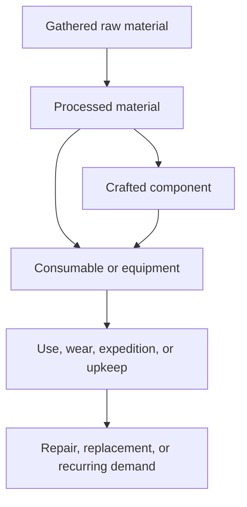

# Evergather / Connected Realms Economy Rebuild Roadmap

**Status:** Working plan for review  
**Repository area:** `worldengine/ichaa` → Connected Realms / Evergather  
**Audit baseline:** `main` at commit `aa8d4e2c56c0225183ec917d96651ae5cfa22fe8`  
**Scope:** Items, gathering rewards, processing, crafting recipes, jobs, shops, tools, expeditions, currencies, and economic sinks

## 1. Goal

Reorganize the Evergather economy into a readable ten-tier system in which:

- every item has an intentional source and at least one meaningful use;
- every high-volume item has a repeatable sink;
- crafting and jobs create connected profession loops instead of isolated reward lists;
- shops cannot be converted directly into unlimited gold or skill XP;
- tools have a complete lifecycle rather than accumulating forever;
- all progression follows the same ten tier milestones;
- the catalog can be audited automatically after future content changes;
- existing player inventories and unique tools can be migrated without silent loss.

This plan deliberately separates **stopping current exploits** from **redesigning the catalog**. Balancing a new catalog while unlimited gold or XP loops still exist would make the balance data unreliable.

## 2. Current Baseline

The current built-in catalogs contain approximately:

| Catalog | Current count |
|---|---:|
| Skills | 38 |
| Tool families | 38 |
| Tool tiers | 10 per family |
| Gathering actions | 91 |
| Skill activities | 310 |
| Recipes | 594 |
| Jobs | 329 |
| Expeditions | 122 |
| Shop offers | 389 |
| Craftable tool variants | 380 |

The existing tier unlock levels are already consistent:

| Tier | Name | Unlock level | Default rarity |
|---:|---|---:|---|
| 1 | Candlemark | 1 | Common |
| 2 | Wayside | 5 | Common |
| 3 | Moonwake | 10 | Uncommon |
| 4 | Hearthsign | 20 | Uncommon |
| 5 | Runebound | 30 | Rare |
| 6 | Stormglass | 40 | Rare |
| 7 | Highguild | 50 | Rare |
| 8 | Elderwake | 65 | Epic |
| 9 | Mythgate | 80 | Legendary |
| 10 | Crownmark | 100 | Mythic |

This tier ladder should remain the canonical progression system. The reorganization should change the content attached to each tier, not invent a second progression ladder.

## 3. Terms Used in This Plan

These definitions prevent a report from calling an item “healthy” merely because it can be discarded.

| Term | Meaning | Examples |
|---|---|---|
| Source | A system that creates an item or currency | Gathering, recipe output, job reward, expedition reward, shop purchase |
| Primary use | The item’s designed gameplay purpose | Ore used in smelting; food consumed for an expedition |
| Primary sink | A use that removes the item while advancing play | Crafting ingredient, repair material, expedition provision |
| Maintenance sink | A recurring use that removes supply over time | Tool repair, settlement upkeep, repeatable consumable |
| Fallback sink | A low-value escape valve, not a designed purpose | NPC sale, salvage, generic liquidation |
| Transfer | Ownership changes, but the item remains in the economy | Player market trade |
| Faucet | A repeatable source of an item, gold, or XP | Gathering action, job payout, expedition chest |
| One-time sink | A sink that stops after progression is complete | First-time tool unlock or building unlock |
| Recurring sink | A sink that continues to absorb supply | Consumables, repairs, fees, upkeep |

**Audit rule:** an NPC vendor, player market listing, or generic requisition does not count as a primary use. A market is a transfer, not a sink.

## 4. Non-Negotiable Economy Invariants

These are the rules every redesign decision must satisfy.

1. Every obtainable item has at least one recorded source.
2. Every non-collectible item has at least one primary use or primary sink.
3. Every repeatably produced item has a recurring sink or a deliberately enforced production limit.
4. A fallback sale cannot be the only reason an item exists.
5. Buying an item from a shop and immediately liquidating it cannot return equal or greater gold.
6. Buying an item cannot generate unlimited profession XP through generic jobs.
7. Player-to-player trade is never counted as item destruction.
8. Job rewards are bounded by the opportunity cost and scarcity of their required inputs.
9. Each tier introduces useful progression without making the immediately previous tier completely worthless overnight.
10. Tools must be consumed, upgraded, repaired, salvaged, retired, or otherwise leave circulation.
11. A displayed tool effect must alter the actual system it names.
12. Runtime-resolved content, including database overrides, must pass the same audits as built-in defaults.
13. Existing item keys remain stable unless an explicit alias and migration are supplied.
14. No item is deleted from player data without a documented conversion outcome.

## 5. Ordered Change Plan

### Phase 0 — Establish the Safe Baseline

**Purpose:** make every later result measurable and reversible.

**Work**

- Create a dedicated economy-rebuild branch.
- Record the exact catalog counts from the resolved runtime catalogs, not only the PHP defaults.
- Export items, sources, recipes, jobs, shops, tools, expeditions, prices, XP, and tier requirements into machine-readable tables.
- Capture database content overrides separately from built-in definitions.
- Record representative player-state fixtures: new player, midgame player, max-tier player, inventory-heavy player, and player with unique tools.
- Freeze unrelated additions of Connected Realms items until the canonical registry is ready.
- Run the current test suite and record known failures before changing behavior.

**Deliverables**

- Baseline catalog export.
- Economy graph showing source and sink edges.
- Before-change test report.
- Player-data migration fixtures.

**Acceptance criteria**

- Every runtime catalog entry can be traced back to its built-in or database source.
- Re-running the export produces a deterministic diff.
- Counts in the export reconcile with the running game.

---

### Phase 1 — Stop Shop-to-Requisition Arbitrage

**Problem:** `ItemPurposeService::requisitionFor` currently creates a one-item requisition for every owned inventory item, with a minimum gold reward and profession XP. Repeatable shop bundles can therefore be purchased, split into one-item requisitions, and turned in for more gold than the purchase cost while also granting unlimited skill XP.

Examples observed in the current catalog include fish, ore, lumber, herbs, and seeds. The exact values should be confirmed against runtime-resolved shop data before implementation.

**Work**

- Remove universal one-item requisitions as a default item purpose.
- Replace them with an explicit requisition catalog or an allowlist of item classes.
- Add quotas, cooldowns, rotation windows, or account-level limits to repeatable procurement jobs.
- Prevent shop-purchased quantities from being an immediately profitable job input, either by pricing, eligibility, provenance, or bounded demand.
- Decide whether shop goods are convenience supplies, catch-up goods, or true commodities; price and limit them according to that role.
- Recalculate XP so it reflects acquisition effort rather than item rarity alone.
- Keep NPC liquidation as a low-value fallback only, with a guaranteed negative spread from shop buy price.

**Recommended default**

- Jobs consume explicitly listed goods.
- Procurement contracts have finite demand per rotation.
- Shop purchase price is always greater than immediate liquidation value plus any associated job rewards.
- Shop-origin provenance should only be introduced if bounded demand and sane pricing cannot solve the problem cleanly.

**Tests**

- For every shop offer, purchase bundle → immediate NPC sale produces a loss.
- For every shop offer, purchase bundle → all immediately available jobs cannot produce positive net gold.
- No repeatable zero-cooldown cycle creates both gold and XP without a gameplay action or scarce input.
- Boundary tests cover bundle quantities, minimum reward floors, rarity multipliers, and rounding.

**Acceptance criteria**

- Automated cycle checks find no positive shop/liquidation path.
- Requisition XP cannot be farmed indefinitely from purchased stock.
- A new player cannot bootstrap an infinite loop from starting gold.

---

### Phase 2 — Separate Real Uses from Fallback Liquidation

**Problem:** `ItemGuideService::addPurposeSinks` assigns a requisition and NPC vendor sink to every item. The existing sink audit injects those generic sinks before checking coverage, so an item with no gameplay use appears healthy.

**Work**

- Add an explicit sink classification: `primary`, `maintenance`, `fallback`, or `transfer`.
- Report source coverage and primary-use coverage independently.
- Remove generic vendor and generic requisition edges from the primary-use audit.
- Treat the player market as a transfer edge.
- Add a separate “can be disposed of” report for fallback sinks.
- Report one-time and recurring sinks independently.
- Flag high-volume faucets that have only one-time sinks.

**Recommended report columns**

| Item key | Tier | Sources | Primary uses | Recurring sinks | Fallback sinks | Transfer routes | Status |
|---|---:|---|---|---|---|---|---|
| Example | 2 | Mining | Smelting | Tool repair | NPC vendor | Player market | Healthy |

**Tests**

- An item with only an NPC sale fails the primary-use audit.
- An item with only a market route fails the sink audit.
- An item with a one-time recipe but unlimited production is flagged for insufficient recurring demand.
- Database overrides cannot silently remove the final primary use of an item.

**Acceptance criteria**

- The audit can truthfully answer three separate questions: “Why does this exist?”, “How does it leave circulation?”, and “Can a player dispose of it?”
- No fallback mechanism is counted as designed content.

---

### Phase 3 — Install Economy Guardrail Tests

**Purpose:** prevent the redesign from reintroducing the same classes of exploit.

**Work**

- Build an economy graph with item, currency, XP, recipe, job, shop, activity, and expedition nodes.
- Add bounded-cycle detection for paths that start and end in gold or an equivalent liquid asset.
- Calculate minimum and maximum values when rewards use ranges.
- Include quantity conversion, reward floors, rounding, cooldowns, quotas, and unlock requirements.
- Audit resolved runtime catalogs, not only hard-coded defaults.
- Make invariant violations fail CI; keep subjective balance warnings as a generated report.

**Required automated checks**

1. Every item has a source.
2. Every non-collectible item has a primary use.
3. Every repeatable faucet has recurring demand or a production cap.
4. Every shop item has negative immediate liquidation value.
5. No unlimited gold/XP cycle exists.
6. Every recipe input exists and is obtainable at or before the recipe’s intended tier.
7. Every recipe output has a use.
8. Every job input is obtainable and every job reward is bounded.
9. All ten tiers have intentional content coverage.
10. Every tool effect has a runtime consumer.
11. Every unique tool has a lifecycle exit.
12. Aliases and migrations cover every retired item key.

**Acceptance criteria**

- A deliberately inserted test exploit is detected.
- The checks run against both defaults and a fixture containing database overrides.
- CI output identifies the exact offending path, not only a pass/fail count.

---

### Phase 4 — Build the Canonical Item Registry and Consolidate Fallback-Only Items

**Problem:** at least 746 current rewards appear to have only generated fallback liquidation rather than a bespoke consumer: roughly 620 skill-activity rewards, 98 generated expedition rewards, and 28 midgame trace items. Exact runtime totals must be regenerated in Phase 0.

**Work**

- Create one canonical registry containing every item key and its economic metadata.
- Assign every item an explicit class, material family, tier, producer, intended consumer, economic role, and lifecycle state.
- Mark each current item as `keep`, `merge`, `rename`, `repurpose`, `currency`, `collectible`, or `retire`.
- Merge flavor duplicates that do not create different gameplay decisions.
- Convert reward-only clutter into shared materials, currencies, reputation, research, settlement resources, or collectibles only where those categories have explicit uses.
- Give remaining activity and expedition rewards defined consumers.
- Define aliases and conversion ratios before retiring keys.

**Canonical item fields**

| Field | Purpose |
|---|---|
| `item_key` | Stable machine identifier |
| `display_name` | Player-facing name |
| `tier` | Canonical tier 1–10 |
| `rarity` | Presentation/scarcity; not a substitute for tier |
| `item_class` | Raw, refined, component, consumable, equipment, tool, currency, quest, collectible |
| `material_family` | Ore, timber, fiber, hide, fish, herb, stone, arcane, etc. |
| `economic_role` | Input, intermediate, finished good, maintenance good, progression token, prestige |
| `producing_skill` | Primary skill that creates it |
| `consuming_skill` | Primary skill/system that removes it |
| `sources` | All valid faucets |
| `primary_uses` | Designed uses |
| `recurring_sinks` | Repeatable removal routes |
| `fallback_sinks` | Vendor/salvage routes |
| `tradeable` | Market eligibility |
| `stackable` | Inventory behavior |
| `status` | Active, alias, deprecated, collectible |
| `replacement_key` | Migration target when consolidated |
| `conversion_ratio` | Quantity conversion during migration |

**Consolidation rules**

- Prefer a reusable family plus tier metadata over ten unrelated names when behavior is identical.
- Keep a unique item when it creates a distinct recipe decision, equipment effect, regional identity, quest meaning, or collection goal.
- Do not keep an item solely because a generated job can consume it.
- Do not use rarity to repair a missing purpose.
- Avoid multiple intermediates that serve the same recipes at the same tier.
- Every intermediate must connect a producer to at least one downstream consumer.
- Collectibles must be labeled as collectibles and excluded from normal sink requirements.
- Currency must have a defined earn/spend loop and a reason not to use gold instead.

**Acceptance criteria**

- Every current key has a disposition and, when needed, a replacement.
- The primary-use audit contains no unexplained fallback-only item.
- The item count falls because redundant reward clutter is removed, not because useful progression is deleted.

---

### Phase 5 — Add a Complete Tool Lifecycle

**Problem:** the 380 craftable tool variants become unique `ConnectedRealmsTool` records rather than ordinary inventory stacks. Current inventory requisitions and NPC sales do not remove them. Durability is stored but does not appear to decrease, and tool-guide sink labels are not backed by executable salvage, repair, retirement, or deletion behavior.

**Work**

- Decide whether tools are durable equipment, consumable equipment, or upgradeable heirlooms. Use one consistent model.
- Implement durability loss on the actions the tool improves.
- Define broken-tool behavior.
- Add repair recipes and costs using tier-appropriate recurring materials and gold.
- Add salvage with deliberately lossy material recovery.
- Add retirement/deletion with explicit confirmation.
- Decide whether upgrading consumes the old tool, preserves identity, or creates a new record.
- Preserve unique IDs, provenance, quality, and history during migration.
- Ensure tools can never be turned into profitable material loops through salvage.

**Recommended default**

- A tool loses durability when it contributes an effect.
- Repairs consume gold plus materials from its own tier or one tier below.
- Salvage returns a minority of materials and no profession XP.
- Tier upgrade consumes the previous tool as a component, keeping the lifecycle compact.
- Crownmark tools remain maintainable and continue consuming endgame resources.

**Tests**

- Equipped-tool actions reduce durability.
- Broken tools stop providing effects.
- Repair restores durability and consumes the exact costs.
- Salvage removes the unique tool record and cannot duplicate materials.
- Craft → salvage and buy → salvage loops are always negative.
- Upgrade migration preserves ownership and intended metadata.

**Acceptance criteria**

- Every crafted tool has at least one executable exit from circulation.
- Tool ownership produces recurring demand at every active tier.

---

### Phase 6 — Connect Crafting Tools to Actual Crafting

**Problem:** `ToolEffectService` can return `material_preservation`, but `CraftingService` does not currently consume the equipped tool or modifier. Crafting and processing tools therefore influence skill-activity loot rather than the material costs of real crafting operations.

**Work**

- Define which action types each tool family modifies: gathering, processing, crafting, repair, expedition preparation, or another explicit system.
- Pass the equipped tool and resolved effects into the actual crafting transaction.
- Apply material preservation deterministically or with an auditable probability model.
- Round quantities consistently and prevent zero-cost crafts.
- Charge durability only when the effect is applied.
- Surface the exact expected benefit in the UI.
- Record effect results in the crafting log for debugging and support.

**Recommended default**

- Preservation returns a bounded portion of consumed inputs after a successful craft; it never makes the craft free.
- Effects use server-side resolution and are recorded in the transaction.
- A tool cannot affect recipes above its permitted tier.

**Tests**

- Crafting without a tool consumes base inputs.
- Crafting with the correct tool applies the stated effect.
- Wrong-family and under-tier tools do not apply.
- Rounding cannot create free single-unit recipes.
- Failed crafts do not consume durability unless that is an explicit design rule.

**Acceptance criteria**

- Every displayed crafting-tool modifier changes the real crafting result.
- Tool effects remain inside the economy guardrails.

---

### Phase 7 — Add Recurring Gold and Material Sinks

**Problem:** many activities create gold, the player market transfers gold without a tax, and most current progression spending weakens after tools are acquired. This allows long-term inflation even after the direct arbitrage loop is fixed.

**Work**

- Measure gold created and destroyed per active hour by progression band.
- Introduce a small player-market listing fee and/or transaction tax.
- Add tool repair fees and material costs.
- Add optional job commissions, rerolls, or contract posting fees.
- Add settlement upkeep, services, or project contributions where they reinforce gameplay.
- Add expedition preparation costs and consumable demand.
- Keep convenience spending optional enough that normal play remains comfortable.
- Avoid a single mandatory sink that punishes one profession more than others.

**Balance targets to define**

| Metric | Target decision |
|---|---|
| Gold faucet per hour by tier | Establish from playtest telemetry |
| Gold sink per hour by tier | Maintain a healthy fraction of faucets |
| Market tax | Enough to remove gold without killing trade |
| Repair burden | Noticeable recurring demand, not constant interruption |
| Job net reward | Positive for gathered/crafted inputs; negative for shop arbitrage |
| Endgame sinks | Repeatable, desirable, and not strictly pay-to-progress |

**Tests and telemetry**

- Gold created/destroyed dashboards by source, sink, tier, and cohort.
- Market volume and price spread before and after fees.
- Repair frequency and tool abandonment rates.
- Job completion rate, average profit, and shop-origin input share.
- Inflation trend for a basket of representative materials.

**Acceptance criteria**

- Endgame play still has desirable recurring spending.
- No single faucet dominates uncontrolled currency creation.
- Market trading remains useful after fees.

## 6. Ten-Tier Consolidation Framework

After Phases 1–3 establish safe guardrails, use the following framework to reorganize all items, recipes, jobs, and tools. Phase 4 can then be completed against an intentional target model rather than by deleting items ad hoc.

### 6.1 Define the Standard Progression Loop

Each normal production chain should identify these roles:

Not every profession needs every box, but no produced node should terminate in “sell it because nothing uses it.”

### 6.2 Give Each Tier a Content Contract

For every tier, define:

- which raw resources enter circulation;
- which processing recipes refine them;
- which components bridge professions;
- which finished goods become usable;
- which jobs demand those goods;
- which tools enable or improve the work;
- which expeditions or settlements consume the output;
- which recurring sink continues after the tier is mastered;
- how the previous tier remains relevant, if intended.

Use this worksheet once per tier:

| Category | Tier decision |
|---|---|
| Unlock level and rarity | From canonical tier table |
| Gathering outputs | |
| Processing outputs | |
| Cross-profession components | |
| Consumables | |
| Equipment/tools | |
| Jobs and demand limits | |
| Expedition requirements/rewards | |
| Settlement uses | |
| Gold faucets | |
| Gold sinks | |
| Recurring material sinks | |
| Previous-tier carry-forward | |

### 6.3 Choose the Cross-Tier Material Philosophy

This is a design decision that must be made before rewriting hundreds of recipes.

**Recommended hybrid model**

- A tier’s common recipes mostly use materials from that tier.
- Important equipment and tools also use a smaller quantity of the previous tier’s refined material.
- Repairs can use current-tier materials plus common lower-tier supplies.
- High-tier prestige projects may consume a broad tier range.
- No recipe should require a lower-tier bottleneck in quantities that force veteran players to monopolize beginner zones.

This preserves demand for older goods without making every high-tier recipe a long pyramid of all previous materials.

### 6.4 Define Item Families Before Names

Agree on the minimum economic families first. A proposed starting taxonomy is:

- **Gathered:** ore, stone, timber, fiber, hide, fish, crops, herbs, creature materials, arcane materials.
- **Processed:** ingot, cut stone, plank, cloth, leather, prepared food, extract, reagent.
- **Components:** fittings, bindings, handles, mechanisms, catalysts, runes.
- **Finished consumables:** meals, tonics, expedition supplies, repair kits, settlement supplies.
- **Finished durable goods:** tools, weapons, armor, accessories, furnishings, structures.
- **Progression resources:** reputation, research, expedition tokens, settlement contributions.
- **Prestige/collection:** trophies, cosmetics, lore objects, titles.

Names should be applied after the family’s role and tier path are proven. Flavor is much easier to expand safely when the economic skeleton is explicit.

### 6.5 Rebuild Recipes

Process recipes family by family, then review them tier by tier.

**For every recipe**

- assign a producing skill and required tier;
- list exact obtainable inputs;
- identify whether it is processing, component assembly, finished craft, repair, upgrade, salvage, or prestige;
- assign the output’s primary consumer;
- record batch size, time, XP, gold cost, tool requirement, and unlock source;
- calculate input opportunity cost and expected output value;
- test preservation, batch rounding, and salvage interactions;
- verify that the recipe does not duplicate another recipe’s economic role.

**Recipe rules**

- Processing recipes turn raw materials into broadly usable intermediates.
- Components should create cross-profession trade, not unnecessary inventory steps.
- Finished goods must be consumed, equipped with wear, contributed, or used in a later upgrade.
- Repair and salvage recipes must be lossy enough to avoid loops.
- XP should reward value added and effort, not raw click count.
- Tier jumps require a documented reason.

**Recipe worksheet**

| Field | Decision |
|---|---|
| Recipe key / name | |
| Tier / skill | |
| Recipe type | |
| Inputs and quantities | |
| Output and quantity | |
| Primary consumer | |
| Tool requirement/effect | |
| Base time / XP / gold | |
| Input value | |
| Expected output value | |
| Recurring demand | |
| Replacement for old recipes | |

### 6.6 Rebuild Jobs as Bounded Demand

Jobs should express what the world currently needs, not provide a universal conversion button for every item.

**Job channels**

- **Tutorial orders:** one-time, teach a profession loop.
- **Local procurement:** rotating finite demand for raw or processed goods.
- **Craft commissions:** bounded demand for finished goods.
- **Repair and maintenance:** recurring demand tied to tools or settlements.
- **Expedition contracts:** provisions and equipment for a named expedition tier.
- **Settlement projects:** large cooperative sinks with staged requirements.
- **Prestige requests:** rare, expensive, nonessential endgame demand.

**For every job**

- assign a demand channel, tier, eligible item keys, quantity, rotation/cooldown, and completion cap;
- price inputs from acquisition effort and market opportunity cost;
- separate gold reward, profession XP, reputation, and unique rewards;
- identify who consumes the submitted items in the fiction and economy;
- ensure shop-bought completion is either intentionally unprofitable or deliberately limited;
- remove generated jobs whose only function is to claim an item has a sink.

**Job worksheet**

| Field | Decision |
|---|---|
| Job key / title | |
| Demand channel | |
| Tier / profession | |
| Required goods | |
| Quantity | |
| Rotation / cooldown / quota | |
| Gold / XP / other reward | |
| Input opportunity cost | |
| Shop-arbitrage result | |
| World consumer | |
| Recurring or one-time | |

### 6.7 Rebuild Activity and Expedition Rewards

- Replace unique reward names that differ only cosmetically with shared, useful families.
- Keep unique rewards only when they support a real recipe, upgrade, collection, or story purpose.
- Make expeditions consume crafted provisions, repair resources, maps, or equipment where appropriate.
- Feed expedition rewards into upgrades, settlement projects, research, or prestige rather than generic liquidation.
- Do not create a new token when an existing currency can serve the same bounded purpose.
- Give every token a complete earn/spend loop and a cap or ongoing sink where necessary.

### 6.8 Rebuild Tool Families Across Ten Tiers

Review all 38 tool families using one shared rule set.

| Decision | Required answer |
|---|---|
| Acquisition | Crafted, upgraded, rewarded, or purchased? |
| Tier materials | Which current and previous-tier materials? |
| Effect | What exact runtime action changes? |
| Equip rules | Skill, level, or tier restrictions? |
| Durability | Loss per use and maximum durability? |
| Repair | Gold/material cost and responsible skill? |
| Upgrade | Does the previous tool get consumed? |
| Salvage | What lossy recovery is allowed? |
| Endgame sink | What keeps Crownmark materials relevant? |

Tool effects should be standardized into a small, readable vocabulary such as speed, yield, quality, preservation, durability efficiency, or success chance. Each effect must have one authoritative calculation path.

## 7. Recommended Working Sequence for the Full Reorganization

Trying to rewrite all 38 professions and ten tiers at once would make balance errors hard to isolate. Use vertical slices.

### Step A — Approve the schema and design rules

Decide the registry fields, sink taxonomy, cross-tier philosophy, job demand channels, tool lifecycle, and balance metrics.

### Step B — Inventory and classify everything

Generate the master registry and give every current item a provisional disposition. Do not delete or migrate yet.

### Step C — Pilot Tier 1 and Tier 2 with two connected loops

Recommended pilot loops:

1. Mining → processing/smelting → smithing/toolmaking → tool use/repair.
2. Fishing/farming → cooking → consumable use → expedition demand.

These pilots cover durable goods, consumables, cross-profession inputs, jobs, shops, repair, and expedition sinks without requiring the entire catalog.

### Step D — Validate the pilot economy

Run graph audits, simulated transactions, focused feature tests, and short playtests. Tune quantities and rewards before copying the model.

### Step E — Expand Tier 1–2 to all professions

Complete the early-game economy and make sure every profession participates in at least one connected loop.

### Step F — Expand upward in paired tiers

Implement and validate Tiers 3–4, 5–6, 7–8, then 9–10. Re-run all guardrails after every pair.

### Step G — Migrate existing content and player data

Apply aliases, quantity conversions, recipe replacements, job replacements, and unique-tool migrations. Preserve an auditable conversion record.

### Step H — Run a compatibility period

Allow deprecated keys to resolve through aliases, show players the conversion outcome, and monitor failed lookups or unexpected inventory changes.

### Step I — Remove deprecated definitions

Only remove compatibility entries after telemetry and support logs show that old keys no longer appear in active data.

## 8. Migration Plan

### 8.1 Content migration

- Add the canonical registry before deleting old definitions.
- Map every retired item, recipe, job, and shop offer to a new key or explicit removal reason.
- Version the catalog and record the version on relevant transactions.
- Apply database overrides to the new schema or disable incompatible overrides explicitly.
- Keep compatibility aliases for at least one release window.

### 8.2 Player inventory migration

- Convert stack quantities using declared ratios.
- Use deterministic rounding and compensate meaningful remainder loss.
- Preserve bound/tradeable state where applicable.
- Log old key, old quantity, new key, new quantity, ratio, player, and migration version.
- Make migration idempotent so a retry cannot duplicate assets.

### 8.3 Unique tool migration

- Preserve unique database identity where possible.
- Map family and tier explicitly rather than by display-name heuristics.
- Preserve owner, quality, durability, provenance, and history.
- If tool mechanics change, initialize durability using a documented rule.
- Never convert a unique tool into an ordinary stack silently.

### 8.4 Recipe and job history

- Keep historical completion logs readable even if definitions are retired.
- Snapshot player-facing titles where needed for old records.
- Do not award replacement rewards a second time during migration.

### 8.5 Rollback readiness

- Take a database backup before production migration.
- Store migration version and per-player completion state.
- Provide a dry-run report with counts and value deltas.
- Define rollback behavior before applying irreversible consolidation.

## 9. Balance and Quality Gates

A tier or profession is not complete until it passes all relevant gates.

### Structural gates

- [ ] All items are in the canonical registry.
- [ ] All active item keys are unique and stable.
- [ ] All items have sources.
- [ ] All non-collectibles have primary uses.
- [ ] All repeatable faucets have recurring sinks or limits.
- [ ] All recipes use obtainable inputs.
- [ ] All outputs feed another system.
- [ ] All jobs have bounded demand.
- [ ] All tools have functional effects and lifecycle exits.
- [ ] All ten tiers match the canonical unlock ladder.

### Exploit gates

- [ ] No shop → vendor profit.
- [ ] No shop → job profit without intentional bounded demand.
- [ ] No free unlimited profession XP.
- [ ] No craft → salvage material duplication.
- [ ] No repair → salvage value creation.
- [ ] No rounding path creates zero-input output.
- [ ] No database override bypasses guardrails.

### Experience gates

- [ ] Every profession has a clear early purpose.
- [ ] Tier upgrades feel meaningful.
- [ ] Previous-tier materials retain only the intended amount of relevance.
- [ ] Inventory complexity is understandable.
- [ ] Job descriptions explain why goods are wanted.
- [ ] Tool effects shown in the UI match server behavior.
- [ ] Endgame has desirable recurring material and gold demand.

### Migration gates

- [ ] Every retired key has a mapping or explicit collectible outcome.
- [ ] Dry-run counts reconcile.
- [ ] Value deltas are reviewed.
- [ ] Migration is idempotent.
- [ ] Historical records remain readable.
- [ ] Rollback procedure is tested.

## 10. Decision Log Template

Use one row for every rule that affects multiple professions or tiers.

| Date | Decision | Options considered | Reason | Systems affected | Revisit trigger |
|---|---|---|---|---|---|
| | | | | | |

Important first decisions:

1. Approve or change the hybrid cross-tier material model.
2. Decide the target maximum number of economically distinct items per tier.
3. Approve the proposed item-family taxonomy.
4. Decide whether quality is separate from tier and rarity.
5. Approve the tool durability/repair/upgrade model.
6. Choose job rotation and quota rules.
7. Choose which systems create gold and which only redistribute it.
8. Decide how database content overrides are governed after consolidation.

## 11. Suggested First Working Session

The next session should not begin by renaming hundreds of items. It should produce the rules that let us make those decisions consistently.

**Session objective:** approve the canonical registry and design the Tier 1–2 pilot.

**Agenda**

1. Confirm the tier table and hybrid cross-tier philosophy.
2. Approve item classes, material families, and economic roles.
3. Set a rough item-complexity budget per tier.
4. Design the Mining → processing → smithing/tool repair loop for Tiers 1–2.
5. Design the Fishing/Farming → cooking → expedition loop for Tiers 1–2.
6. Define the exact jobs, shop role, recurring sinks, and payout rules for those loops.
7. Run the proposed loops through the structural and exploit gates.
8. Use the approved pilots as templates for the remaining professions.

**Outputs from that session**

- Approved registry schema.
- Approved economy-wide rules.
- Tier 1–2 item list for the two pilots.
- Tier 1–2 recipe list for the two pilots.
- Tier 1–2 job list for the two pilots.
- Tool lifecycle values for the pilot tools.
- Explicit migration mappings for the current items replaced by the pilots.

## 12. Relevant Current Code Areas

- [`EvergatherTierCatalog.php`](https://github.com/icha-senpai/worldengine/blob/aa8d4e2c56c0225183ec917d96651ae5cfa22fe8/ichaa/app/Domain/ConnectedRealms/Services/EvergatherTierCatalog.php) — canonical tier definitions.
- [`ItemPurposeService.php`](https://github.com/icha-senpai/worldengine/blob/aa8d4e2c56c0225183ec917d96651ae5cfa22fe8/ichaa/app/Domain/ConnectedRealms/Services/ItemPurposeService.php) — generated requisitions and item-purpose behavior.
- [`ItemGuideService.php`](https://github.com/icha-senpai/worldengine/blob/aa8d4e2c56c0225183ec917d96651ae5cfa22fe8/ichaa/app/Domain/ConnectedRealms/Services/ItemGuideService.php) — current source/sink guide and classification behavior.
- [`CraftingService.php`](https://github.com/icha-senpai/worldengine/blob/aa8d4e2c56c0225183ec917d96651ae5cfa22fe8/ichaa/app/Domain/ConnectedRealms/Services/CraftingService.php) — real crafting transaction path.
- [`ToolEffectService.php`](https://github.com/icha-senpai/worldengine/blob/aa8d4e2c56c0225183ec917d96651ae5cfa22fe8/ichaa/app/Domain/ConnectedRealms/Services/ToolEffectService.php) — tool modifier resolution.
- [`ShopService.php`](https://github.com/icha-senpai/worldengine/blob/aa8d4e2c56c0225183ec917d96651ae5cfa22fe8/ichaa/app/Domain/ConnectedRealms/Services/ShopService.php) — shop purchase behavior.
- [`JobContractService.php`](https://github.com/icha-senpai/worldengine/blob/aa8d4e2c56c0225183ec917d96651ae5cfa22fe8/ichaa/app/Domain/ConnectedRealms/Services/JobContractService.php) — job completion behavior.
- [`SkillCatalogService.php`](https://github.com/icha-senpai/worldengine/blob/aa8d4e2c56c0225183ec917d96651ae5cfa22fe8/ichaa/app/Domain/ConnectedRealms/Services/SkillCatalogService.php) — skill and activity catalog resolution.

## 13. Definition of Done

The reorganization is complete when:

- all active content is represented in the canonical registry;
- all 38 skills participate in understandable ten-tier production or consumption loops;
- every non-collectible item has a real purpose and every repeatable output has continuing demand;
- recipes, jobs, shops, tools, activities, expeditions, and settlements use the same tier and item metadata;
- tools wear, repair, upgrade, salvage, and affect the systems they claim to affect;
- automated tests reject profitable liquidation loops, unlimited XP loops, false sink coverage, and invalid tier links;
- the gold economy has measured recurring sinks;
- player data migrates without silent loss or duplication;
- deprecated compatibility keys can be removed safely;
- new content cannot enter the game without declaring its source, purpose, tier, and sink.

